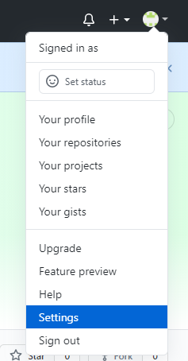
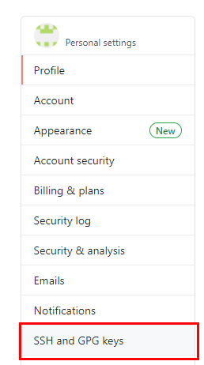
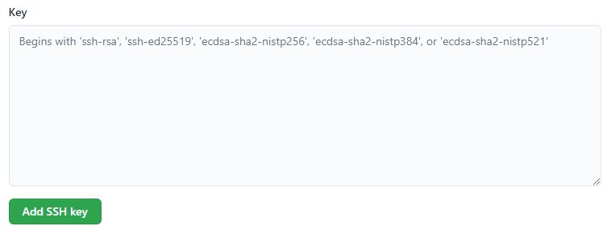

[< back to contents](./readme.md)

# Adding public ssh-key to github.com

1. Copy the ssh public key to clipboard:
   ```
   clip < ~/.ssh/your_key.pub
   ```
   or copy it manualy from file `~/.ssh/your_key.pub`
2. In the upper-right corner of any page, click your profile photo, then click **Settings**.   
    
3. In the user settings sidebar, click **SSH and GPG keys**.   
    
4. Click **New SSH key** or **Add SSH key**.   
    
5. In the "Title" field, add a descriptive label for the new key. For example name of you PC.
6. Paste your key into the "Key" field.   
    
7. Click **Add SSH** key.   
    
8. If prompted, confirm your GitHub password.
   
So, now you can push your work to github from local machine using SSH key

[<Previous](./ssh.md) ... [Next>](./config.md)